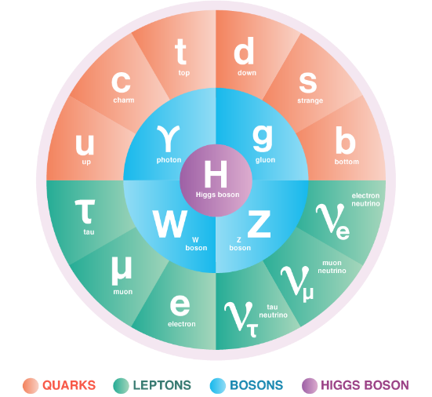
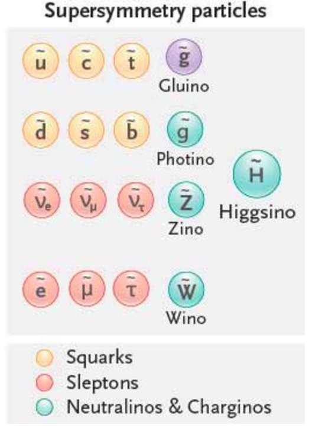

# Convolutional neural network neutrino reconstruction in IceCube

---

## The Standard Model of particle physics

Image courtesy of Sandbox Studio, Chicago for Symmetry

---

## SM limit

What can't we explain?

* Gravity
* Dark matter
* Dark energy
* Neutrino masses
* Matter-antimatter asymmetry

---

## Neutrinos

What are these ghostly particles? How did we discover them? When did we first observe them?

* Something or other
* Something other or other

---

## The physics potential of neutrinos

What can we learn, if we can reconstruct?

---

## IceCube Neutrino Observatory

What is this behemoth on the South Pole?

---

## DeepCore / Upgrade

What's the future potential of the behemoth?

---

## Anatomy of an event

So, how does an event play out?

---

## The challenge of reconstruction

Why is it hard to reconstruct? How do they do it now?

---

## Machine Learning in physics

Can ML be used in physics? What is it useful for?

---

## Convolutional neural networks

CNNs... do they make sense for this problem?

---

## Temporal convolutional networks

Maybe TCNs are better suited?

---

## IceCube tooling & data

Before we may train, tooling & data we must have!
But IceCube's tooling ain't great, and IceCube's data structure is not really suited for ML.

---

## CubeDB

I built CubeDB to fix the data situation.

---

## Powershovel

I built Powershovel to fix the tooling situation.

---

## CubeFlow

CubeFlow does the training and inference. And it does it quickly!

---

## Results

Here are the results.

---

## Future

Where can this go?

Convolutional neural network neutrino reconstruction in IceCube